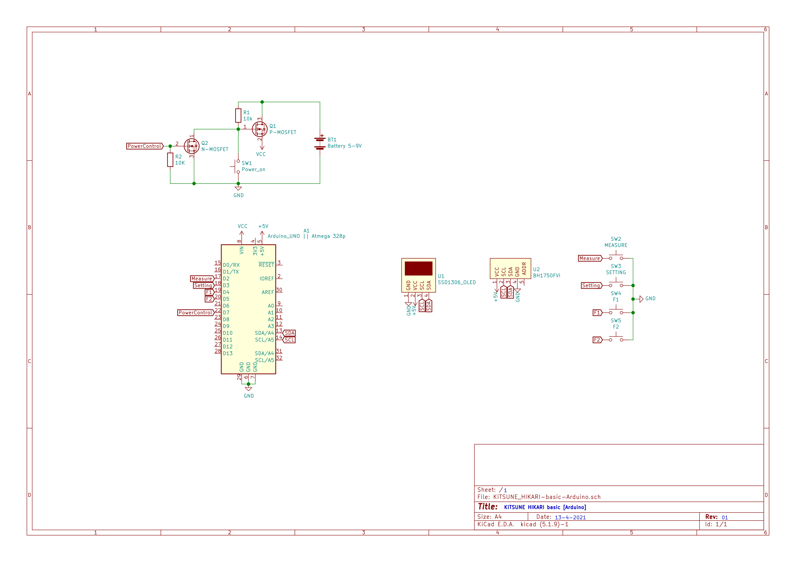

# KiTSUNE HIKARI Basic 🦊
>
Basic light meter for film camera  
  
Manu  
- [Feature](#Feature)
- [Microcontroller support](#Microcontroller-support)
- [Requirement](#Requirement)
- [Schematic](#Schematic)
- [How to use](#How-to-use)
  
## Feature
- Aperture priority mode only.
- Type of measurement.
  - reflected-light mode
  - incident-light mode
  > default incident-light mode.
- Auto shutdown
  - 1-5 min.
  > default 1min.
- Auto sleep
  - 15-45 sec.
  > default 25sec.
  > 
## Microcontroller support
- Arduino Uno R3
- Arduino Pro mini
- Arduino Nano
- Arduino Leonardo / micro / pro micro
- Other Atmega328p microcontroller with Arduino bootloader 
## Requirement
### Hardware
- Microcontroller
- BH1750FVI (Light sensor)
- SSD1306 OLED display 128x32
### Software
- Arduino IDE
### Library
- Adafruit_GFX
- Adafruit_SSD1306
- BH1750FVI ( by PeterEmbedded )
## Schematic


## How to use
press or hold ***[ F1 ]*** button in main screen for change aperture
> Min 0.95  
> Max 22
> 
press or hold ***[ F2 ]*** button in main screen for change ISO
> Min 12  
> Max 6400
> 
### Setting page
in setting have 4 page
- Type of measurement
- Auto sleep time
- Auto shutdown time
- Rrset to default

press ***[ F1 ]*** for next page and ***[ F2 ]*** for previous page  
if want to exit setting press ***[ setting ]*** button for save and exit  
>
### measurement page
press ***[ measure ]*** button for switch mode between reflected-light mode and incident-light mode
>
### Sleep time page  
press ***[ measure ]*** button for increase time  
> min 15 sce.  
> max 45 sec.  
> *If value is exceeded press hold button and value will circle again.*  
>
### Shutdown time page  
press ***[ measure ]*** button for increase time
> min 1 min.  
> max 5 min.  
> *If value is exceeded press hold button and value circle again.*  
>
### Reset page  
press ***[ measure ]*** button for reset to default  
after press confirm in first page to confirm to reset press ***[ measure ]***  
if want to cancle press ***[ F1 ]***   
  
if want to castom value by yousalf go to line 580-587  
default is
```
TYPE_measure      = 0;
AepSelect         = 10;
APERTURE          = 2.8;
isoSelect         = 9;
ISO               = 100;
SLEEP_TIME        = 25000;   //25 sce.
SHUTDOWN_TIME     = 60000;   //1 min.
```
> TYPE_measure
> - 0 : incident mode
> - 1 : reflected mode
> 
> AepSelect APERTURE isoSelect ISO  
> *you can see at line 263-396*
> 
> SLEEP_TIME and SHUTDOWN_TIME  
> measured in milliseconds.  
> 
